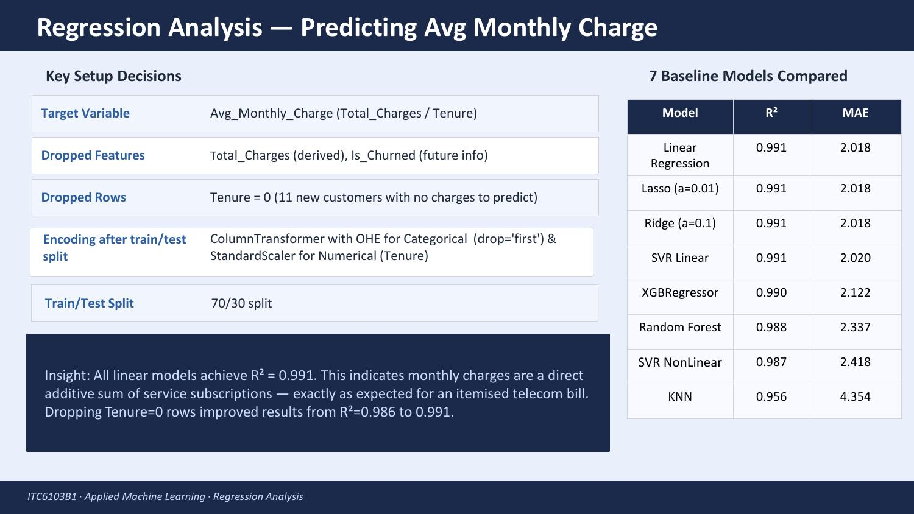
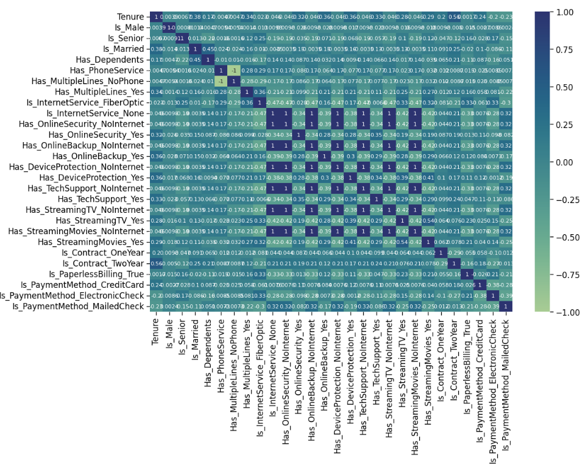
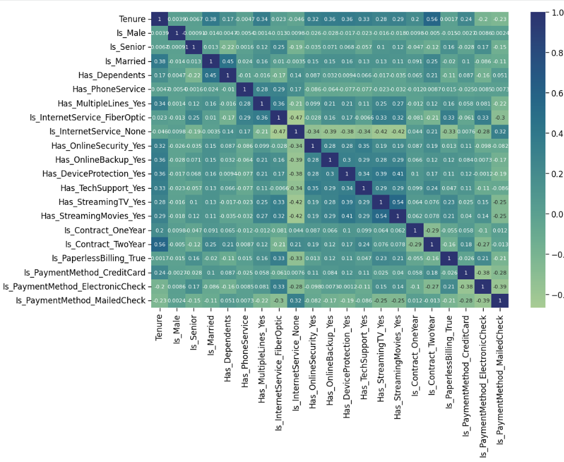
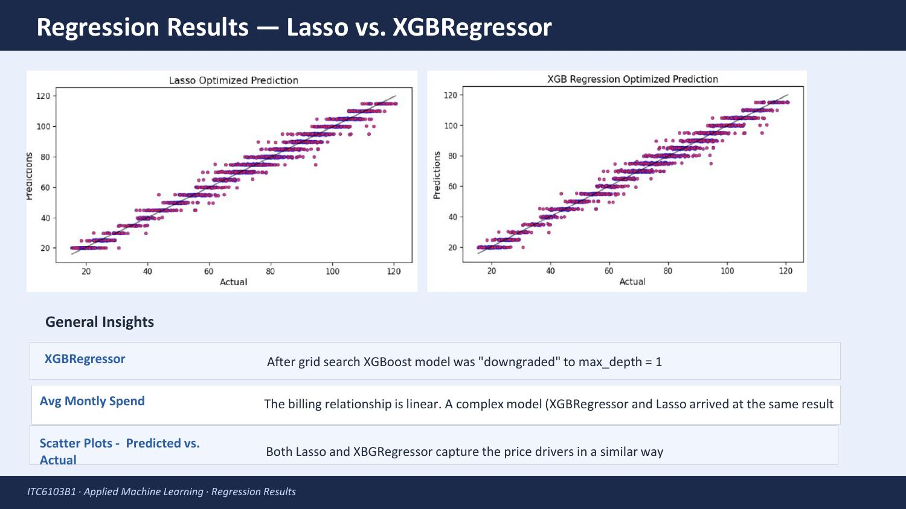
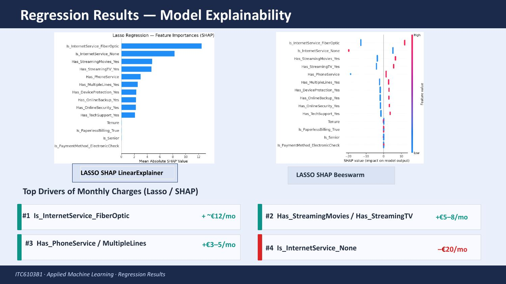
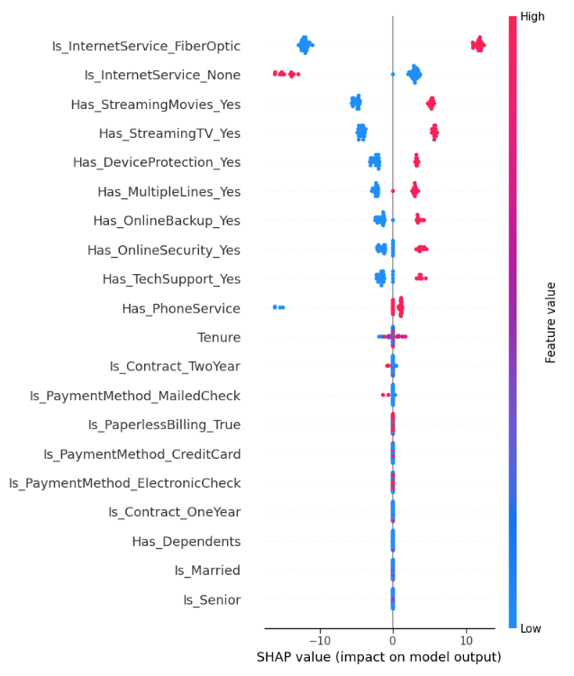
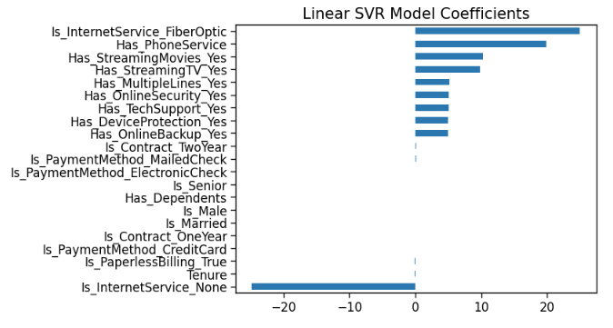

# Telecom Customer Intelligence: Churn Risk & Spend Prediction Pipeline

An end-to-end Machine Learning strategy and operations project analyzing the **IBM Telco Customer Churn dataset** (7,043 customer profiles), delivering two production-oriented ML capabilities:

1. **Strategic Classification Engine** — predicts binary customer churn to trigger proactive retention interventions
2. **Operational Regression Engine** — reverse-engineers itemized billing dynamics to forecast monthly spend, audit contract anomalies, and evaluate product-tier revenue contribution

**Course:** ITC6103B1 · Applied Machine Learning, Winter Term 2026 · The American College of Greece
**Team:** Kimon Lappas, Ioannis Logothetis, Milena Mirumyan, [Katerina Psallida](https://github.com/kpsalida)

---

## Key Findings & Strategic Recommendations

1. **Focus retention on critical churn profiles** — month-to-month subscribers churn at **15× the rate** of 2-year contract customers (42.7% vs. 2.8%). Targeted long-term contract conversion campaigns yield the highest customer lifetime value.
2. **Deploy tuned SVM for proactive intervention** — the optimized SVM (RBF kernel, `class_weight='balanced'`) captures **75% of true churners** (421 of 561 test accounts) vs. Random Forest's 48% — **+152 additional at-risk accounts identified per evaluation cycle**.
3. **Itemized billing is strictly linear** ($R^2 = 0.991$, MAE ≈ €2.02) and determined purely by service-tier subscriptions — household configuration (Family/Couple/Single) has **zero** impact on billing.
4. **Targeted upselling & discounting** — Fiber Optic connectivity adds **+€12/month** to the bill but carries the highest churn risk. Bundling premium streaming (+€5–8/month) into long-term contracts can protect margin while locking in retention.

---

## 🎯 My Contribution: Operational Regression Engine

I owned the full regression pipeline end-to-end — from target variable design through final model explainability — detailed in [`Regression_ML_Katerina.ipynb`](Regression_ML_Katerina.ipynb) and Section 4 of the full report.

### Target Design & Setup

I framed this deliberately as an *operational* question rather than a sales one: not "which contract should we sell this customer," but "what is this customer actually spending, given the contract they already have." That framing decided the target variable.

**Target feature formulation:** raw `Total_Charges` was heavily correlated with contract duration (r = 0.83 with `Tenure`) — a confound that would let any model "cheat" by learning tenure instead of actual spending behavior. I designed `Avg_Monthly_Charge` (`Total_Charges ÷ Tenure`) instead, isolating true monthly spending behavior regardless of how long someone has held their contract.

To keep the target clean, I dropped:
- `Monthly_Charges` — highly correlated with the engineered target itself
- `Total_Charges` — the target is directly derived from it
- `Is_Churned` — future information that would leak into training
- All `Tenure = 0` rows — 11 brand-new customers with no real spending history to model yet

**Leakage-free preprocessing:** rather than one-hot encoding the whole dataset up front, I applied a `ColumnTransformer` fitted strictly on the training split — with production deployment specifically in mind: encoding before the split risks the test (or future live) data producing different dummy columns than training did, silently breaking a deployed model. `StandardScaler` handled the numeric `Tenure` feature; `OneHotEncoder(drop='first', handle_unknown='ignore')` handled categoricals — the `handle_unknown` setting specifically so the pipeline won't crash on a new category value appearing in future live data.

Across 7 baseline model architectures, every linear model converged to the same result: **R² = 0.991, MAE ≈ €2.02**. One small but telling finding: dropping just 11 `Tenure = 0` rows out of ~7,000 measurably improved every model's metrics — a reminder that regression algorithms can be surprisingly sensitive to small data-quality details and outliers, not just headline feature choices.

### Collinearity: Before & After

Checking the training set's correlation matrix post-encoding revealed perfect correlation (r = 1.0) between six `_NoInternet`-suffixed fields and `Is_InternetService_None` — they were all encoding the same information redundantly.

| Before: redundant NoInternet/NoPhone fields | After: collinearity removed |
|---|---|
|  |  |

I dropped the six redundant `_NoInternet` columns plus `Has_MultipleLines_NoPhone` (already covered by `Has_PhoneService`), leaving a clean, non-redundant feature set for modeling.

### Feature Selection & Model Competition

- **Domain hypothesis testing:** engineered `Household_Type` (Family / Couple / Single Parent / Single Adult) from marital and dependent status — inspired by a similar technique from coursework on the Titanic dataset — and tested whether household composition affects pricing. It didn't: R² stayed at 0.991 regardless, for both the linear and boosted models.
- **Why Lasso and XGBoost specifically:** Lasso was selected for the feature-engineering phase because it performs built-in feature selection, zeroing out coefficients for irrelevant features; XGBoost was the strongest performer among the non-linear models tested, making it the natural boosting counterpart to compare against.
- **Dimensionality reduction:** used Lasso's zero-coefficient features to prune from 28 encoded features down to 14, with no accuracy loss
- **Hyperparameter tuning:** grid search on XGBoost converged to `max_depth=1` — confirmation, from the model's own tuning process, that the underlying relationship is genuinely simple and additive rather than one that benefits from deep trees

### Model Accuracy: Predicted vs. Actual

Both the simple linear model (Lasso) and the complex gradient-boosted model (XGBoost, ultimately tuned down to depth-1 stumps) converge on the same predictions — strong evidence that the billing structure really is linear, not an artifact of one particular algorithm.

### Explainability: What Actually Drives a Customer's Bill

Using SHAP (`LinearExplainer` on Lasso, `TreeExplainer` on XGBoost), I decoded the model into exact, defensible monetary drivers:

| Driver | Monthly Impact |
|---|---|
| Fiber Optic Service | **+€12.00** |
| Streaming (Movies / TV) | +€5.00 to +€8.00 |
| Phone Service & Multiple Lines | +€3.00 to +€5.00 |
| Premium Tech Support & Online Security | +€2.00 to +€3.00 |
| Demographics (age, household, billing channel, tenure) | €0.00 — no effect |
| No Internet Service (baseline) | **−€20.00** |

Ranking every service feature by significance (highest to lowest): **Fiber Optic, Phone Service, Streaming Movies, Streaming TV, Tech Support, Multiple Lines, Online Security, Device Protection.**

**A methodological note worth surfacing:** linear model coefficients give you both magnitude *and* direction for free — a positive or negative sign tells you immediately whether a feature raises or lowers the bill. Tree-based feature importances (like XGBoost's) only report *significance*, not direction. That's precisely why SHAP was necessary rather than optional here: it's what reveals that `Is_InternetService_None` pushes spending sharply *downward*, a fact XGBoost's raw feature importances alone couldn't have told us.

### Cross-Validation with a Third Model Family: SVR

To stress-test whether these findings were an artifact of the two model families already used (linear + boosted trees), I ran the same explainability analysis on Support Vector Regression — a fundamentally different algorithm:

| SVR SHAP Beeswarm | Linear SVR Coefficients |
|---|---|
|  |  |

The SVR results reproduce the same ranking — Fiber Optic and Phone Service as the strongest positive drivers, `Is_InternetService_None` as the strongest negative one. Three independent model families (linear regression, gradient boosting, and support vector regression) converging on the same conclusions is a much stronger basis for a business recommendation than any single model's output alone.

---

## Data & Tools

- **Data source:** [IBM Telco Customer Churn Dataset (Kaggle)](https://www.kaggle.com/datasets/blastchar/telco-customer-churn)
- **Data files:** `raw_telco.csv`, `ml_ready_dataset.parquet`, `ml_ready_dataset_nodummies.parquet`
- **Preprocessing, pipeline & ML:** Python (pandas, scikit-learn, XGBoost)
- **Explainable AI (XAI):** SHAP (`LinearExplainer` & `TreeExplainer`), Permutation Importance
- **Hyperparameter optimization:** `GridSearchCV`, `RandomizedSearchCV`
- **Reporting & documentation:** Jupyter Notebook, Google Colab, MS Word, PowerPoint

## Files in This Repository

| File | Description |
|---|---|
| `cleaning_eda.ipynb` | EDA, categorical distributions, outlier checks, baseline cleaning |
| `Regression_ML_Katerina.ipynb` | **[My Contribution]** Full regression pipeline: ColumnTransformer, collinearity pruning, 8-model benchmark, hyperparameter optimization, SHAP explainability |
| `telco_churn_rf_svm.ipynb` | Supervised classification: Random Forest vs. SVM (RBF), class imbalance handling |
| `read_data.ipynb` | Data loading and inspection routines |
| `tuned_xgboost_model.pkl` | Serialized, hyperparameter-tuned XGBoost model |
| `ml_ready_dataset.parquet` | Cleaned, encoded feature matrix |
| `ml_ready_dataset_nodummies.parquet` | Cleaned pre-encoding dataset for modular ColumnTransformer pipelines |
| `raw_telco.csv` | Raw IBM Telco dataset (7,043 rows, 21 attributes) |
| `environment.yml` | Conda environment / dependency versions |
| `Report.pdf` | Full academic group research paper (36 pages) |
| `Presentation.pdf` | Executive stakeholder slide deck |

---

## Full Model Comparison

| Model | Test R² | MAE (€) | Notes |
|---|:---:|:---:|---|
| **Linear Regression (OLS)** | **0.991** | **2.018** | Baseline parametric model; captures additive pricing perfectly |
| **Lasso Regression** | **0.991** | **2.018** | α = 0.01; pruned 14 zero-weight features with no accuracy loss |
| **Ridge Regression** | **0.991** | **2.018** | α = 0.1; L2 shrinkage confirms stability of service weights |
| **Linear SVR** | 0.991 | 2.020 | Support vectors mirror the linear hyperplane |
| **XGBoost (Tuned)** | 0.991 | 2.022 | GridSearchCV converged to `max_depth=1` — shallow, additive trees |
| **Random Forest** | 0.988 | 2.337 | 100 estimators; slight underperformance vs. pure linear models |
| **SVR (RBF Kernel)** | 0.987 | 2.418 | Non-linear margin mapping — added complexity, no benefit |
| **K-Nearest Neighbors** | 0.956 | 4.354 | Distance metric sensitive to binary feature sparsity |

## Conclusions

- The dataset is described exceptionally well by linear regression models — Lasso specifically shows the highest R² and lowest MAE
- Removing collinear features (post-OHE) and dropping `Tenure = 0` rows both measurably improved results
- Engineering the `Household_Type` feature made no difference to either the linear or boosting models — pricing is service-driven, not demographically tiered
- Age, billing method, and tenure itself do not meaningfully contribute to spending magnitude
- Findings are robust across three independent model families: linear, gradient-boosted trees, and SVR
